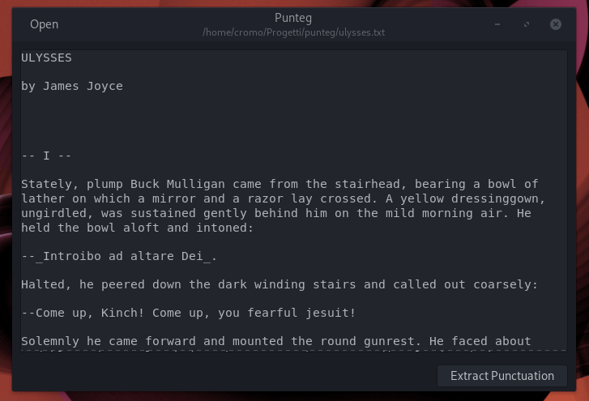

[](https://stopthemingmy.app)

# Punteg



**Punteg** takes a set of text and extract punctuation from it.

## Build
Run `meson build` to configure the build environment, then `ninja install` to
intall on your system:

```
meson build --prefix=/usr
cd build
sudo ninja install
```
